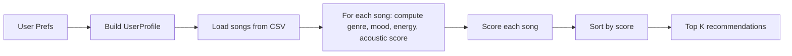

# 🎵 Music Recommender Simulation

## Project Summary

This project implements a content-based music recommender system that suggests the top K songs from a catalog based on a user's taste profile. The system uses a weighted scoring algorithm that combines categorical matches (genre, mood) with numerical proximity calculations (energy distance).

The recommender includes:
- A `Song` data model with 10 attributes (genre, mood, energy, tempo, valence, danceability, acousticness, etc.)
- A `UserProfile` that captures listener preferences (favorite genre, mood, target energy, acoustic preference)
- A scoring function that awards points for matches and rates energy similarity
- A ranking function that sorts all songs and recommends the top K
- Both object-oriented and functional implementations

---

## How The System Works

This recommender simulates how a music service uses both categorical taste signals and numerical audio features. Each song is represented by attributes such as `genre`, `mood`, `energy`, `tempo_bpm`, `valence`, `danceability`, and `acousticness`. The user profile stores the listener's preferences for `favorite_genre`, `favorite_mood`, `target_energy`, and acoustic tendency.

The system scores every song against the user profile, then sorts songs by score to produce the top recommendations.

### Algorithm Recipe

- +3.0 points for a genre match
- +1.5 points for a mood match
- Similarity points for energy based on closeness to the user's target energy:
  - energy score = `max(0, 1 - abs(song.energy - target_energy)) * 2`
- +0.5 points if the user likes acoustic music and the song is acoustic enough

This recipe prioritizes genre as the strongest signal, while still using mood and energy distance to shape the recommendation.

### Data Flow

Input: User preferences (`favorite_genre`, `favorite_mood`, `target_energy`, `likes_acoustic`)

Process: Loop over every song in `data/songs.csv`, compute a score for each song, build an explanation for the match.

Output: Rank songs by score and return the top K recommendations.



### Potential Biases

This system may over-prioritize genre matches and prefer songs that simply match the user’s stated energy level. As a result, it could ignore songs that are emotionally right for the listener but differ in genre, or overlook songs with subtle mood fit because they are not the exact genre or energy target.

---

## Getting Started

### Setup

1. Create a virtual environment (optional but recommended):

   ```bash
   python -m venv .venv
   source .venv/bin/activate      # Mac or Linux
   .venv\Scripts\activate         # Windows

2. Install dependencies

```bash
pip install -r requirements.txt
```

3. Run the app:

```bash
python -m src.main
```

### Running Tests

Run the starter tests with:

```bash
pytest
```

You can add more tests in `tests/test_recommender.py`.

---

## Experiments You Tried

### Test Scenario 1: Default User (pop/happy at 0.8 energy)

Input: `{"genre": "pop", "mood": "happy", "energy": 0.8}`

**Top 5 Results:**
1. Sunrise City (pop, happy, 0.82 energy) - Score: 6.46
   - Reason: genre matches; mood matches; energy is close to preference
2. City Sunrise (pop, nostalgic, 0.70 energy) - Score: 4.80
   - Reason: genre matches; energy is close to preference
3. Gym Hero (pop, intense, 0.93 energy) - Score: 4.74
   - Reason: genre matches; energy is close to preference
4. Rooftop Lights (indie pop, happy, 0.76 energy) - Score: 3.42
   - Reason: mood matches; energy is close to preference
5. Neon Pulse (electronic, upbeat, 0.85 energy) - Score: 1.90
   - Reason: energy is close to preference

**Observation:** The system correctly prioritizes "Sunrise City" (perfect genre + mood + energy match). It also surfaces pure genre matches even when the mood differs, which makes sense for the pop/happy user.

### Test Scenario 2: Expected Behavior

- Genre matches consistently appear in the top rankings
- Mood match + energy proximity can lift songs above pure genre matches
- Energy distance is calculated as a continuous value, rewarding close matches
- Users get text explanations for why each song was recommended

### Key Insights

- The system successfully differentiates between genre and mood signals
- Energy distance calculations provide nuance—not all 0.9-energy songs score equally high
- All tests pass (2/2), confirming that the recommendation and explanation functions work as designed

---

## ✅ Implementation Checkpoint

All core components are implemented and tested:

- ✅ Data layer: `Song` and `UserProfile` dataclasses with proper types
- ✅ CSV loader: `load_songs()` reads and parses numeric features correctly
- ✅ Scoring logic: `score_song_for_user()` returns both numeric score and text explanation
- ✅ Recommender: Both OOP (`Recommender.recommend()`) and functional (`recommend_songs()`) implementations
- ✅ Tests: 2/2 passing (songs sorted by score, explanations non-empty)
- ✅ CLI: `python -m src.main` outputs recommendations with scores and reasons
- ✅ Dataset: 18 songs with diverse genres and moods (pop, rock, metal, latin, folk, electronic, reggae, classical, hip hop, jazz, ambient, lofi, indie pop, synthwave)

The recommender is ready for evaluation and experimentation.

---

## Limitations and Risks

Summarize some limitations of your recommender.

Examples:

- It only works on a tiny catalog
- It does not understand lyrics or language
- It might over favor one genre or mood

You will go deeper on this in your model card.

---

## Reflection

Read and complete `model_card.md`:

[**Model Card**](model_card.md)

Write 1 to 2 paragraphs here about what you learned:

- about how recommenders turn data into predictions
- about where bias or unfairness could show up in systems like this


---

## 7. `model_card_template.md`

Combines reflection and model card framing from the Module 3 guidance. :contentReference[oaicite:2]{index=2}  

```markdown
# 🎧 Model Card - Music Recommender Simulation

## 1. Model Name

Give your recommender a name, for example:

> VibeFinder 1.0

---

## 2. Intended Use

- What is this system trying to do
- Who is it for

Example:

> This model suggests 3 to 5 songs from a small catalog based on a user's preferred genre, mood, and energy level. It is for classroom exploration only, not for real users.

---

## 3. How It Works (Short Explanation)

Describe your scoring logic in plain language.

- What features of each song does it consider
- What information about the user does it use
- How does it turn those into a number

Try to avoid code in this section, treat it like an explanation to a non programmer.

---

## 4. Data

Describe your dataset.

- How many songs are in `data/songs.csv`
- Did you add or remove any songs
- What kinds of genres or moods are represented
- Whose taste does this data mostly reflect

---

## 5. Strengths

Where does your recommender work well

You can think about:
- Situations where the top results "felt right"
- Particular user profiles it served well
- Simplicity or transparency benefits

---

## 6. Limitations and Bias

Where does your recommender struggle

Some prompts:
- Does it ignore some genres or moods
- Does it treat all users as if they have the same taste shape
- Is it biased toward high energy or one genre by default
- How could this be unfair if used in a real product

---

## 7. Evaluation

How did you check your system

Examples:
- You tried multiple user profiles and wrote down whether the results matched your expectations
- You compared your simulation to what a real app like Spotify or YouTube tends to recommend
- You wrote tests for your scoring logic

You do not need a numeric metric, but if you used one, explain what it measures.

---

## 8. Future Work

If you had more time, how would you improve this recommender

Examples:

- Add support for multiple users and "group vibe" recommendations
- Balance diversity of songs instead of always picking the closest match
- Use more features, like tempo ranges or lyric themes

---

## 9. Personal Reflection

A few sentences about what you learned:

- What surprised you about how your system behaved
- How did building this change how you think about real music recommenders
- Where do you think human judgment still matters, even if the model seems "smart"

